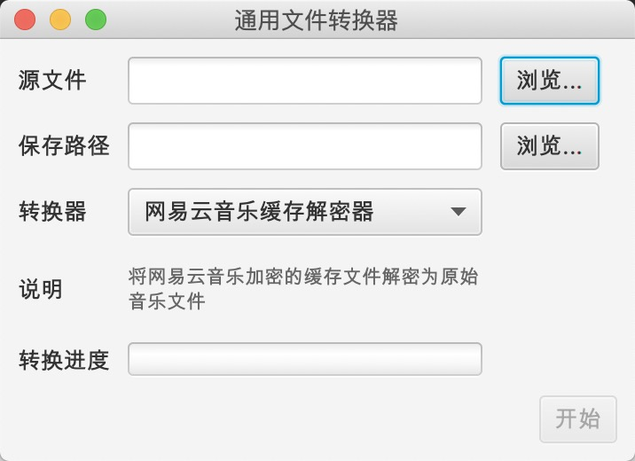

# 通用文件转换器

通用的文件转换器GUI程序，在使用同一个UI见面的基础上，允许加载自定义的`FileConvertor`完成转换工作。

## 内置转换器

+ 网易云音乐缓存文件转换器
+ 通用文件加解密(使用异或算法)

## 截图

## 自定义转换器

1. 实现`org.xialei.convertor.FileConvertor`接口(必须)
2. 如果转换器需要执行初始化逻辑(如读取配置文件)，实现`org.xialei.convertor.ui.Initializable`(可选)
3. 编辑`config.properties`的`convertors`配置，添加转换器类全名
4. 启动主程序，程序启动时会读取`config.properties`文件自动加载配置的转换器